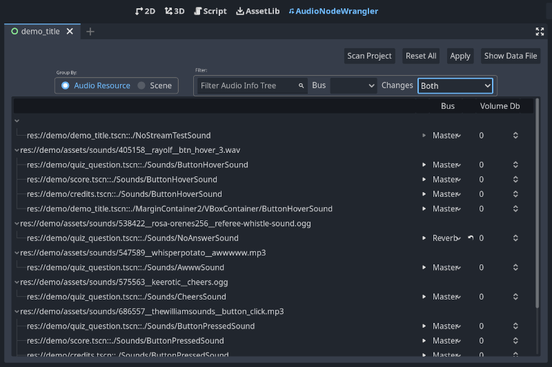
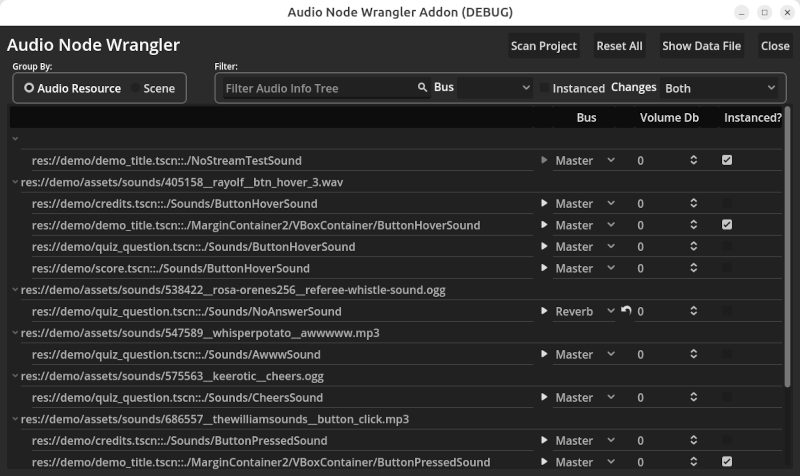
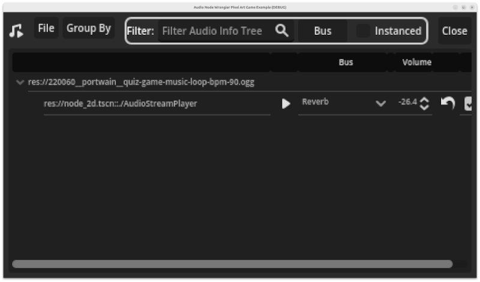
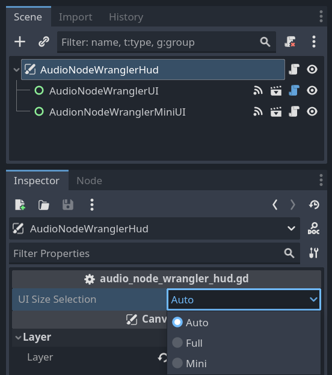
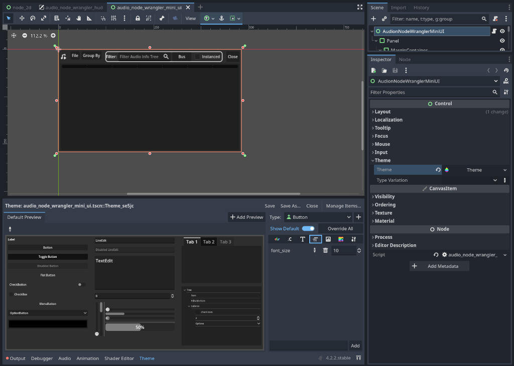

# Audio Node Wrangler Add-on

With this Godot 4 add-on you can manage audio node volume and bus settings in the editor on one screen as well as an in-game HUD. This allows non-programmers to set sound levels and busses during play testing, even for a web game. The resulting configuration file can then be sent to the programmer to update the sound node settings.

## Install

To install this add-on, look for it in the Godot asset library. Or you can download this repository and copy the addons/audio_node_wrangler folder to your project.

## Demo
While the github repository contains a demo, you must clone it in order to get those files. This is due to the addition of a .gitattributes file that makes it so only the addons folder is included in the downloaded zip file. This is to make installing from the asset library cleaner. You can read more about this at https://docs.godotengine.org/en/stable/community/asset_library/submitting_to_assetlib.html#introduction .

## How To Use

The audio node wrangler consists of a main screen UI and an in-game HUD.

### Main Screen UI
Audio nodes can be managed from the Main Screen UI. Just click on the AudioNodeWrangler button located near the top middle of the Godot editor window.

Main Screen UI 

When first added, the add-on will show no audio node data in the list that takes up the bulk of the UI. To fill the list, click the Scan Project button.

The buttons in the UI do the following:

- Scan Project - scans all scene files (.tscn) for audio nodes and updates the add-on data file with their settings. This operation DOES NOT overwrite any bus or volume settings that have been modified.
- Reset All - scans project files like the Scan Project button, but ALL settings are reset.
- Apply - Modifies any project file with changed settings. Note that an attempt to NOT update files with changes not committed to git are made. You can turn this check off. However, it is recommended that all changes be committed before applying audio node wrangler settings.
- Show Data File - opens file explorer showing the audio_node_wrangler_data.json file. This file can be shared with other members of your team.

### In-Game HUD
The in-game HUD for the add-on comes in two flavors. The default is the same UI as found in the editor and is used for games with view port sizes greater than 880x400. For games with smaller view port sizes, usually associated with pixel art games, a different UI is used that accommodates this smaller screen. These user interfaces present the same information as the UI found in the editor but some functionality is disabled.

To bring up the HUD press F1 while your game is running. (F1 is the default button for the "toggle_audio_node_wrangler_hud" action added to your project by the add-on.)

NOTE: The in-game HUD is only available during debugging or for exports with debug enabled. For release exports, the HUD is not available so that players cannot access it.

Default In-Game UI  

The buttons in the default UI do the same as described above for the Main Screen UI. However, for a web exported game, the 
audio_node_wrangler_data.json file is downloaded. The additional Close button closes the HUD.

Mini In-Game UI  

For pixel art games, a mini version of the UI is used (shown above). It has has the same functionality as the default UI but many of those features are now in menu drop-downs. For example all file related functions to scan, reset, and show the data file are in the File drop-down menu. To change the grouping displayed in the lower panel, select one of the choices in the Group By drop-down. All the other controls, save the Close button, are for filtering, and work the same way as for the default UI.

#### Forcing the Default or Mini HUD UI
The in-game HUD has a setting that allows you to force either the default or mini HUD UI. Open the HUD scene (res://addons/audio_node_wrangler/ui/audio_node_wrangler_hud.tscn) and change it's UI Size Selection setting. The default is Auto, which means if the view port size set for the game is less than 880x440, it will choose the mini UI over the default UI.

HUD UI Size Selection 

#### Changing the Mini UI Theme
You may find that the font size choice for the mini UI isn't to your liking. To change this and other theme-able properties just edit the mini UI scene (res://addons/audio_node_wrangler/ui/audio_node_wrangler_mini_ui.tscn) and edit the theme on the root node.

Updating Mini UI's Theme 

## Credits

This Godot add-on demo uses these sounds from freesound.org:

- "quiz game music loop BPM 90.wav" by portwain ( http://freesound.org/s/220060/ ) licensed under CC0
- "btn_hover_3.wav" by rayolf ( http://freesound.org/s/405158/ ) licensed under CC0
- "Button_Click" by TheWilliamSounds ( http://freesound.org/s/686557/ ) licensed under CC0
- "Cheers" by keerotic ( http://freesound.org/s/575563/ ) licensed under CC0
- "awwwww.mp3" by WhisperPotato ( http://freesound.org/s/547589/ ) licensed under CC0
- "Referee whistle sound.wav" by Rosa-Orenes256 ( http://freesound.org/s/538422/ ) licensed under CC0
- "Rabbit Bop" by code_box (https://freesound.org/s/575759/) licensed under CC0

##  Support This and Other Free Tools
If you would like to support my development work to maintain this and other such projects you can do so at https://www.buymeacoffee.com/jlothamer.

